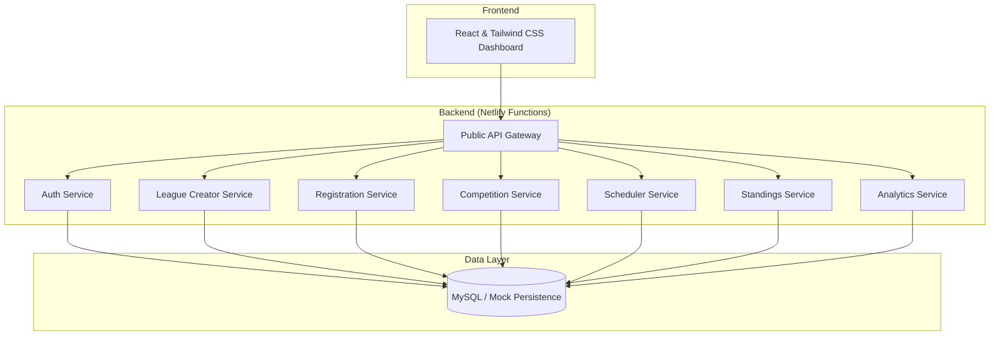

# A League of Our Own 🏆

A multi-tenant league management platform that supports any competition type—from sports and eSports to casual gaming.

**Production:** [gilded-piroshki-2bd9dc.netlify.app](https://gilded-piroshki-2bd9dc.netlify.app/)  
**Staging:** [staging--gilded-piroshki-2bd9dc.netlify.app](https://staging--gilded-piroshki-2bd9dc.netlify.app/)

## 🚀 Overview

**A League of Our Own** is a full-stack application that enables users to create and manage custom leagues. Administrators have full control over scoring rules, roster management, and scheduling, while participants can track their progress through real-time standings and dynamic analytics.

## 🏗️ Architecture: Service-Oriented (SOA)

The backend follows a microservice-inspired architecture using Netlify Functions. A **Public API Gateway** provides a unified entry point for the frontend, orchestrating requests to specialized domain services.



### Services & Responsibilities

- **Public API Gateway**: Single entry point for all frontend requests. Handles routing, global validation, and request orchestration.
- **Auth Service**: Manages user identity, JWT-based mock authentication, and session handling.
- **League Creator Service**: Manages the lifecycle of a league, including initial setup, metadata updates, and configuration of scoring rules.
- **Registration Service**: Handles user enrollment into leagues, invite code generation, and validation.
- **Competition Service**: Manages the active list of members (roster) and is responsible for recording/updating game results and participation data.
- **Scheduler Service**: Responsible for organizing seasons and generating game schedules/match timings.
- **Standings Service**: Calculates real-time league tables, user rankings, and overall performance metrics based on game results.
- **Analytics Service**: Provides advanced insights, historical trend analysis, and performance projections for players and leagues.

## 🛠️ Tech Stack

- **Frontend**: React, Tailwind CSS, Lucide-react.
- **Backend**: Netlify Functions (Node.js/Vanilla JS).
- **Database**: MySQL (using `mockData.js` for session persistence during developement).
- **Auth**: JWT-based mock authentication.

## 💻 Local Development

### Prerequisites

- **Node.js**: v18+ recommended.
- **Netlify CLI**: Install globally: `npm install -g netlify-cli`.

### Commands

1.  **Install dependencies**:
    ```bash
    npm install
    cd ui && npm install
    ```

2.  **Start Development Server**:
    From the root directory:
    ```bash
    netlify dev
    ```
    This launches the React app and Netlify Functions proxy on `http://localhost:8888`.

## 📈 Project Roadmap

We are currently transitioning from a prototype architecture to the full Service-Oriented (SOA) model. The legacy `services/league-service.js` is being phased out in favor of the specialized services in the `services/` directory.

---
Created with ❤️ by the ALeagueOfOurOwn Team.
